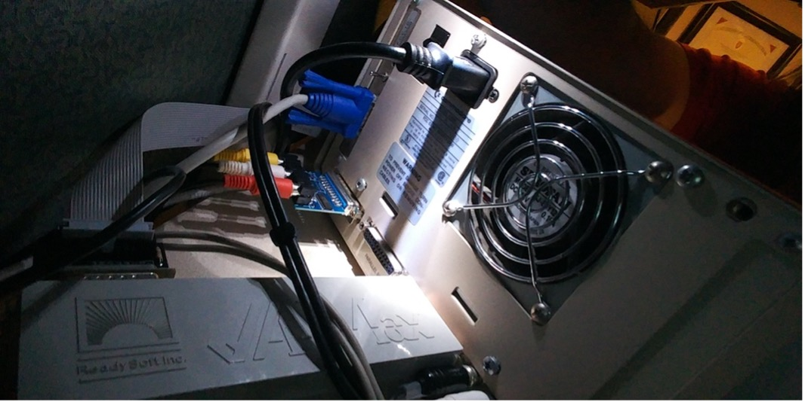
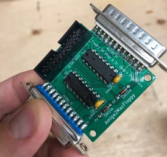
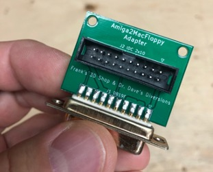
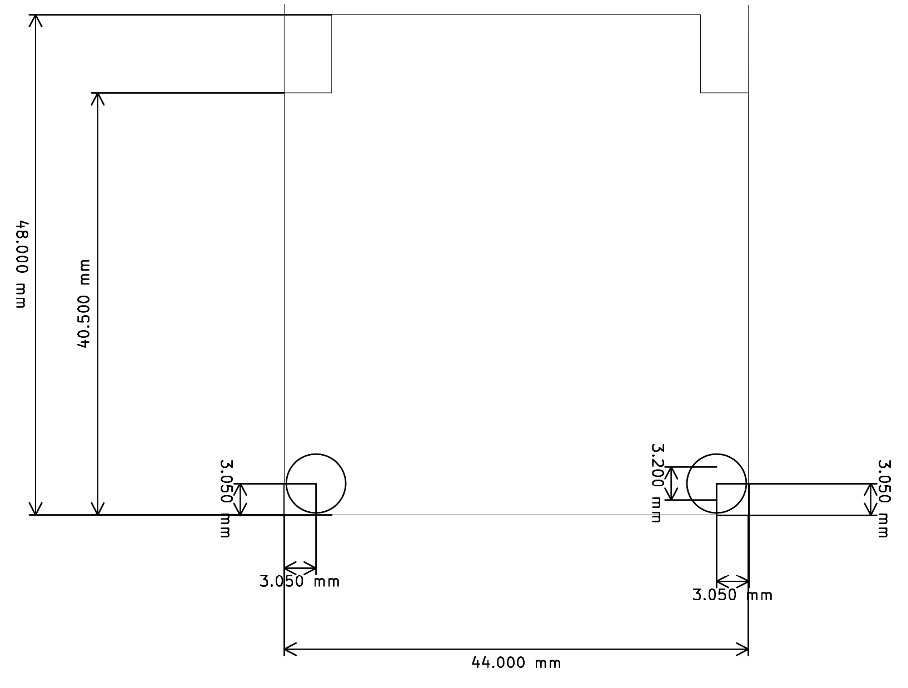

# Amiga2MacFloppy
Amiga2MacFloppy, a reversed-engineered A-Max interface

Video of the project from Dr. Dave's Diversions channel, we did this project together:
https://youtu.be/zkYM3wdAgQM?t=42

# General Description

The original A-Max II software allowed to emulate a Macintosh computer on the Amiga and provided an interface (Figure 1) to connect an external Apple floppy drive and use it in emulation. It is also compatible with CrossMAC on the Amiga so you can read Mac floppies on the Amiga.

Amiga2MacFloppy (Figure 2) is a recreation of that board without the Mac ROMs that were required on the original board. It works all the same with a patched version of A-Max II so that it loads the ROMs from file instead.

This interface is designed to receive the IDC connector directly from a 3.5 inch Mac floppy drive or FloppyEmu. You also have the option to the DB19M to IDC adapter (Figure 3) to connect an external Mac floppy drive.

Figure 1-Amax II Interface

Figure 2: The Amiga2MacFloppy Interface

Figure 3 - Adapter DB19M to IDC 2x10

# Software Configuration

## CrossMAC

CrossMAC is Amiga software, consisting of device driver(s) and an
accompanying application, that allows the use of Mac HFS volumes
on the Amiga; the volumes can be mounted, read, and written. This
includes both Mac HFS-formatted 800KB floppy disks and SCSI-attached
Mac HFS hard drive partitions. For floppy disks, of course, some
hardware interface is required to connect the Amiga to a "classic"
Mac-compatible double density floppy drive; Amiga2MacFloppy is
that interface.

Amiga2MacFloppy is known to work with CrossMAC software v1.05 running
on Amiga Release 2.1 system software accompanied by either (a) the
FloppyEmu hardware emulator (in Mac floppy mode; *not* in HD20 mode),
(b) an Apple 3.5 inch double density floppy drive (external DB19
connector), or (c) a Cutting Edge branded 3.5 inch Mac-compatible
double density floppy drive (DB19 connector).

To use CrossMAC with an attached Amiga2MacFloppy, install the
CrossMAC software per its instructions.

## Using CrossMAC

Once CrossMAC installed successfully, HFS-formatted Mac floppy
disks should appear on the Amiga desktop when inserted and can
be accessed much like Amiga FFS volumes.  Launch the CrossMAC
application; this will display the HFS volumes current mounted
and provides Mac-specific HFS volume features such as ejecting
Mac floppy disks and specifying whether Mac HFS files should be
shown in Workbench having Both Forks, Data Fork, or MacBin Only.
split resource and forks.

If you do not have CrossMac, you can
find it on archive.org in this set of
[CommodoreAmigaApplications](https://archive.org/details/CommodoreAmigaApplicationsADF).

## A-Max

A-Max is the first Macintosh emulator on the Amiga, introduced in
1989. A-Max takes over the entire Amiga when it is running, i.e. does
not multitask with Amiga applications. As such, A-Max II is unique,
amongst Mac emulators on Amiga, in that the entire Amiga is dedicated
to the Mac operations making it fast and highly compatible with
early Mac software when emulating a Macintosh Plus, for example.

Amiga2MacFloppy is known to work with A-Max II software version
2.5 having the "Fast A-Max" patch and running on Amiga Release
2.1 system sofware accompanied by a Mac Plus 128K ROM image file,
and either (a) the FloppyEmu hardware emulator (in Mac floppy mode;
/not/ HD20 mode), (b) an Apple 3.5 inch double density floppy drive
(external DB19 connector), or (c) a Cutting Edge branded 3.5 inch
Mac-compatible double density floppy drive (DB19 connector).

To use A-Max II software with an attached Amiga2MacFloppy, you must
use a version of A-Max patched to read the Mac ROM image from a
file rather than from the (2) DIP ROMs that were required in the
original A-Max "cartridge" (an interface that connected to the
Amiga's external floppy disk port) that Amiga2MacFloppy replaces.

The "Fast A-Max" patch modifies the A-Max II software, such as
version 2.5, to read the ROM image from a file called "Mac_ROMs"
in the same directory as the patched A-Max executable. This file
has a format specific to the Fast A-Max patch, but it can be easily
created, e.g. from a 128KB Mac Plus ROMs image file used by other
Mac emulators.  The file simply has a special 32-bit (4 byte)
header; this header contains two 16-bit numbers. The first field
indicates the size of ROM image follows (0x75 for 128KB Mac Plus
ROMs); the second field indicates the drive number or position
where the hardware interface is installed.

For example, a Mac_ROMs image file might begin like this:

	$ hexdump Mac_ROMs |head -1
	0000000 7500 0500 1f4d 7281 4000 2a00 7500 0060
	        ^^^^ ^^^^ ^^^^^^^^^^^^^^^^^^^^^^^^^^^^^
		|    |    |
		|    |    Mac [128KB] ROM image begins here
		|    |
		|    drive number (16-bit value, low byte first) here
		|
		Indicates 128KB (Mac Plus) ROM image follows

Typically, one might install the Amiga2MacFloppy as the second
drive, e.g. the first external drive on an Amiga 500, i.e. `df1:`,
if it were an Amiga floppy drive. In this case, the Mac ROM image
file should indicate the Mac floppy drive has the Amiga floppy drive
number of 4. That is, the ROM image file must specify drive number
4 like this:

	$ hexdump Mac_ROMs |head -1
	0000000 7500 0400 1f4d 7281 4000 2a00 7500 0060
	             ^^^^

Alternatively, one might install the Amgia2MacFloppy as the third
drive, e.g. the first external drive on an Amiga 2000 having two
internal 3.5 inch Amiga floppy drives, i.e. `df2:` if it were an
Amiga floppy drive. In this case, the Mac ROM image file should
indicate the Mac floppy drive has the Amiga floppy drive number of
5. That is the ROM image file must specify drive number 5 like this:

	$ hexdump Mac_ROMs |head -1
	0000000 7500 0500 1f4d 7281 4000 2a00 7500 0060
	             ^^^^

For your convenience, we make available two Fast A-Max-compatible ROM
image files containing Mac Plus 128KB ROMs and configured for either
of those two options. These are `Mac_ROMs_df1` and `Mac_ROMs_df2`
respectively and you just must copy (or rename) this to a file named
`Mac_ROMs` before starting A-Max II.

Aside: This unusual Mac ROM image file format is necessitated by
the Fast A-Max patch, not by Amiga2MacFloppy, per se. Since the
Fast A-Max patch replaces the portion of A-Max code that finds,
identifies, and loads the external ROMs, this special file header
is used by the patch code to store that necessary information and
convey it to the A-Max software so that A-Max knows the sort of Mac
ROMs supplied (either 64KB or 128KB) and also so that A-Max knows
how to locate the hardware interface to access floppy disks.

Note that if you change the number of Amiga floppy drives positioned
before the Amiga2MacFloppy interface, e.g. if you install an
additional Amiga floppy drive in an Amiga 2000, you will have to
change the Mac ROM image file to one in which the header reflects
the new device number/position of the Amiga2MacFloppy.

# Using A-Max

Most of the use of A-Max is outside the scope of this documentation.
Once properly configured, however, your Amiga2MacFloppy will behave
just like a external 800KB drive connected to a Macintosh Plus,
for instance. You can even boot Macintosh System software from this
external floppy drive.

In our testing of A-Max II software version 2.5 having the Fast A-Max
patch, we have found no difference between using Amiga2MacFloppy and
using the original A-Max hardware interface. The rare incompatibility
with Macintosh software is likely due to the A-Max emulator, itself,
rather than the floppy drive interface. For example, the original
Microsoft Flight Simulator for the Macintosh is known not to work
with A-Max due to Flight Simulator's heinous requirement that the
original floppy disk must be installed in the internal Macintosh
floppy drive. However, the Mac-compatible floppy drive you attach
when using A-Max always appears as an external floppy drive, thus
it can't be used to run Flight Simulator.

# Dimensions

Figure 4: Dimensions of the Amiga2MacFloppy Board

# PCB Fabrication
You can get the board from PCBWay or any other manifacturer of your choice with the provided gerber zip files.
The default settings from PCBWay should be correct, I prefer to get "HASL lead free" boards to save on the environement https://www.pcbway.com/project/shareproject/Amiga2MacFloppy.html

# Assembly instructions
The PCB fits the 3D printed case provided, You have to center and push the DB23 connectors up to the board, try it first in the case before soldering.

# Revision History
Rev. 1
* Board cleaned up
* OpenHardware Logo added
* Remove the not needed resistor
* Added DB19 and DB23 reference files for KiCAD
* Tested and working

# LICENCE
©2021 Frank's 3D Shop & Dr. Dave's Diversions

 This work is licensed under a <a rel="license" href="http://creativecommons.org/licenses/by/4.0/">Creative Commons Attribution 4.0 International License</a>.
